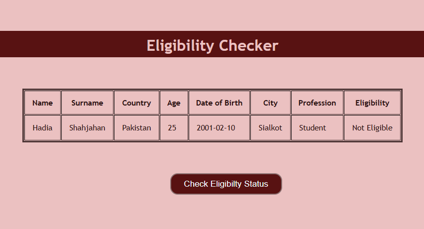

# Eligibility Checker

A simple React application that displays user information and checks whether a user is eligible based on their age. The application calculates the user's age from the provided date of birth and updates the eligibility status when the button is clicked.


## Table of Contents

* [Features](#features)
* [Preview Image](#preview-image)
* [Technologies Used](#technologies-used)
* [Project Structure](#project-structure)
* [Project Files](#project-files)
* [How It Works](#how-it-works)
* [Installation](#installation)
* [Eligibility Logic](#eligibility-logic)
* [Documentation](#documentation)
* [Author](#author)


## Features

* Displays user information in a table
* Calculates age from the user's date of birth
* Checks eligibility based on age
* Updates eligibility status dynamically using React state
* Simple and clean user interface


## Preview Image 




## Technologies Used

* React
* JavaScript (ES6+)
* CSS3
* Vite


## Project Structure

```text
src/
├── main.jsx
├── User.jsx
└── User.css
```


## Project Files

* [`src/main.jsx`](./src/main.jsx) – Creates the React application and passes user data as props.
* [`src/User.jsx`](./src/User.jsx) – Displays user information and performs the eligibility check.
* [`src/User.css`](./src/User.css) – Styles the application.


## How It Works

1. User information is stored in an object inside `main.jsx`.
2. The object is passed to the `User` component using props.
3. When the **Check Eligibility Status** button is clicked, the application:

   * Calculates the user's age from the date of birth.
   * Updates the displayed age.
   * Determines whether the user is eligible.
4. The eligibility status is displayed in the table.


## Installation

Clone the repository:

```bash
git clone https://github.com/hadiashah01/react-core-concepts
```

Move into the project directory:

```bash
cd react-core-concepts
```

Install dependencies:

```bash
npm install
```

Start the development server:

```bash
npm run dev
```


## Eligibility Logic

```javascript
if (calcAge > 18 && calcAge < 25) {
  setEligibilityStatus("Eligible");
} else {
  setEligibilityStatus("Not Eligible");
}
```


## Documentation

* [React Documentation](https://react.dev/)
* [Vite Documentation](https://vitejs.dev/)
* [JavaScript (MDN)](https://developer.mozilla.org/docs/Web/JavaScript)
* [React useState Hook](https://react.dev/reference/react/useState)


## Author

**Hadia Shahjahan**
